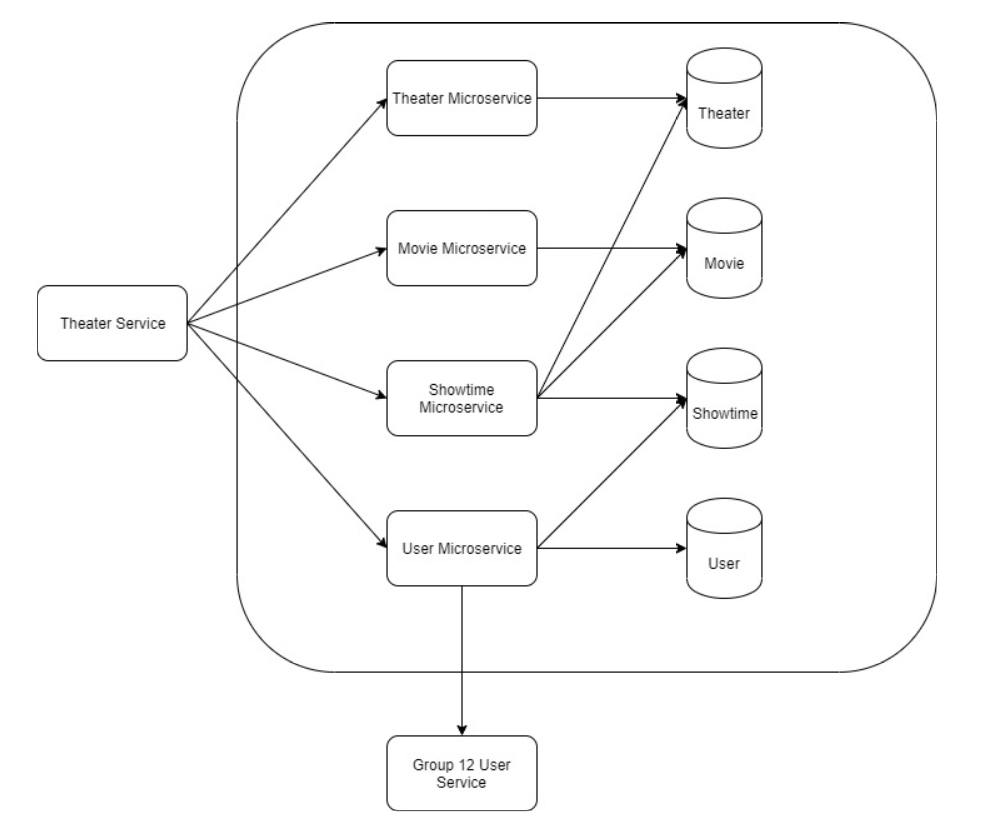

# Thearter-API
Repository for Service Oriented Programming | ITKMITL 2019

## Business Flow

<p align="center">
    
</p>

## Usage

# Showtime Service

### List all Showtimes
URL : `/api/showtime`

Method : `GET`

Response example

```json
[
  {
    "id": "5da32f48accef147705f4dd4",
    "movieId": "1",
    "theaterId": "1",
    "movieName": "JOKER",
    "movieThumbnail": "picpath",
    "movieReleaseDate": "3-OCT-2019",
    "movieLength": "120",
    "movieDescription": "This is Short Description of This Film",
    "time": "11.00",
    "date": "4-OCT-2019",
    "status": true
  },
  {
    "id": "5da32fc4accef147705f4dd5",
    "movieId": "1",
    "theaterId": "1",
    "movieName": "JOKER",
    "movieThumbnail": "picpath",
    "movieReleaseDate": "3-OCT-2019",
    "movieLength": "120",
    "movieDescription": "This is Short Description of This Film",
    "time": "14.00",
    "date": "4-OCT-2019",
    "status": true
  },
  {
    "id": "5da32fcfaccef147705f4dd6",
    "movieId": "1",
    "theaterId": "2",
    "movieName": "JOKER",
    "movieThumbnail": "picpath",
    "movieReleaseDate": "3-OCT-2019",
    "movieLength": "120",
    "movieDescription": "This is Short Description of This Film",
    "time": "12.00",
    "date": "4-OCT-2019",
    "status": true
  },
  {
    "id": "5da32fd8accef147705f4dd7",
    "movieId": "1",
    "theaterId": "2",
    "movieName": "JOKER",
    "movieThumbnail": "picpath",
    "movieReleaseDate": "3-OCT-2019",
    "movieLength": "120",
    "movieDescription": "This is Short Description of This Film",
    "time": "17.00",
    "date": "4-OCT-2019",
    "status": true
  }
]
```

### List all Showtimes by TheaterId
URL : `/api/showtimes?theater={theaterId}`

Method : `GET`

Response example

```json
[
  {
    "id": "5da32f48accef147705f4dd4",
    "movieId": "1",
    "theaterId": "1",
    "movieName": "JOKER",
    "movieThumbnail": "picpath",
    "movieReleaseDate": "3-OCT-2019",
    "movieLength": "120",
    "movieDescription": "This is Short Description of This Film",
    "time": "11.00",
    "date": "4-OCT-2019",
    "status": true
  },
  {
    "id": "5da32fc4accef147705f4dd5",
    "movieId": "1",
    "theaterId": "1",
    "movieName": "JOKER",
    "movieThumbnail": "picpath",
    "movieReleaseDate": "3-OCT-2019",
    "movieLength": "120",
    "movieDescription": "This is Short Description of This Film",
    "time": "14.00",
    "date": "4-OCT-2019",
    "status": true
  }
]
```

### List all Showtimes by MovieId

URL : `/api/showtime?movie={movieId}`

Method : `GET`

Response example

```json
[
  {
    "id": "5da32f48accef147705f4dd4",
    "movieId": "1",
    "theaterId": "1",
    "movieName": "JOKER",
    "movieThumbnail": "picpath",
    "movieReleaseDate": "3-OCT-2019",
    "movieLength": "120",
    "movieDescription": "This is Short Description of This Film",
    "time": "11.00",
    "date": "4-OCT-2019",
    "status": true
  },
  {
    "id": "5da32fc4accef147705f4dd5",
    "movieId": "1",
    "theaterId": "1",
    "movieName": "JOKER",
    "movieThumbnail": "picpath",
    "movieReleaseDate": "3-OCT-2019",
    "movieLength": "120",
    "movieDescription": "This is Short Description of This Film",
    "time": "14.00",
    "date": "4-OCT-2019",
    "status": true
  },
  {
    "id": "5da32fcfaccef147705f4dd6",
    "movieId": "1",
    "theaterId": "2",
    "movieName": "JOKER",
    "movieThumbnail": "picpath",
    "movieReleaseDate": "3-OCT-2019",
    "movieLength": "120",
    "movieDescription": "This is Short Description of This Film",
    "time": "12.00",
    "date": "4-OCT-2019",
    "status": true
  },
  {
    "id": "5da32fd8accef147705f4dd7",
    "movieId": "1",
    "theaterId": "2",
    "movieName": "JOKER",
    "movieThumbnail": "picpath",
    "movieReleaseDate": "3-OCT-2019",
    "movieLength": "120",
    "movieDescription": "This is Short Description of This Film",
    "time": "17.00",
    "date": "4-OCT-2019",
    "status": true
  }
]
```

### Get Showtime by Id
URL : `/api/showtime/{id}`

Method : `GET`

Response example

```json
{
    "id": "5da32f48accef147705f4dd4",
    "movieId": "5da32f48accef147705f4dd4",
    "theaterId": "5da32f48accef147705f4dd4",
    "date": "4-OCT-2019",
    "time": "11.00",
    "status": true,
    "availableSeats": ["A3", "A4", ..., "B10"]
}
```

### Delete All Showtime by Date
URL : `/api/showtime/{date}`

Method : `GET`

### Add Showtime
URL : `/api/showtime`

Method : `POST`

Request example

```json
{
  "movieId": "5da32f48accef147705f4dd4",
  "theaterId": "5da32fcfaccef147705f4dd6",
  "date": "4-OCT-2019",
  "time": "11.00",
  "status": true
}
```

Response example

```json
{
  "id": "5da32f48accef147705f4dd4",
  "movieId": "5da32f48accef147705f4dd4",
  "theaterId": "5da32f48accef147705f4dd4",
  "date": "4-OCT-2019",
  "time": "11.00",
  "status": true,
  "availableSeats": ["A1", "A2", ..., "B10"],
  "unavailableSeats": null
}
```

### Delete Showtime by Id
URL : `/api/showtime?id={id}`

Method : `DELETE`

# Movie Service

### List all Movie Information
URL : `/api/movie`

Method : `GET`

Response example

```json
[
  {
    "id": "5da321b7accef147705f4dd0",
    "movieId": "1",
    "movieName": "JOKER",
    "movieThumbnail": "picpath",
    "movieReleaseDate": "3-OCT-2019",
    "movieLength": "120",
    "movieDescription": "This is Short Description of This Film"
  },
  {
    "id": "5da326b8accef147705f4dd2",
    "movieId": "2",
    "movieName": "The Matrix",
    "movieThumbnail": "picpath",
    "movieReleaseDate": "24-OCT-2019",
    "movieLength": "120",
    "movieDescription": "This is Short Description of This Film"
  }
]
```

### Show Movie Information by MovieId
URL : `/api/movie/{movieId}`

Method : `GET`

Response example

```json

{
  "id": "5da321b7accef147705f4dd0",
  "movieId": "1",
  "movieName": "JOKER",
  "movieThumbnail": "picpath",
  "movieReleaseDate": "3-OCT-2019",
  "movieLength": "120",
  "movieDescription": "This is Short Description of This Film"
}

```

### Add Movie Information
URL : `/api/movie`

Method : `POST`

Request example

```json
{
  "movieName": "The Matrix",
  "movieThumbnail": "picpath",
  "movieReleaseDate": "24-10-2019",
  "movieLength": "104",
  "movieDescription": "This is Short Description of This Film"
}
```

Response example

```json
{
    "_id": "5db2fab7accef10da071ca0d",
    "movieName": "The Matrix",
    "movieThumbnail": "picpath",
    "movieReleaseDate": "24-10-2019",
    "movieLength": "104",
    "movieDescription": "This is Short Description of This Film"
}
```

### Edit Movie Information
URL : `/api/movie/{id}`

Method : `PUT`

Request example

```json
{
  "movieName": "The Matrix",
  "movieThumbnail": "picpath",
  "movieReleaseDate": "24-10-2019",
  "movieLength": "120",
  "movieDescription": "This is Short Description of This Film"
}
```

Response example

```json
{
  "_id": "5db2fb23accef10da071ca0e",
  "movieName": "The Matrix",
  "movieThumbnail": "picpath",
  "movieReleaseDate": "24-10-2019",
  "movieLength": "120",
  "movieDescription": "This is Short Description of This Film"
}
```

### Delete Movie Information
URL : `/api/movie/{id}`

Method : `DELETE`


# Theater Service

### Add Theater
URL : `/api/theater`

Method : `POST`

Request example

```json
{
  "theaterId": "3",
  "seats": ["A1", "A2", ..., "B10"]
}
```

Response example

```json
{
  "id": "5da32a9eaccef147705f4dd3",
  "theaterId": "3",
  "seats": ["A1", "A2", ..., "B10"]
}
```

# User Service

### Reserve
URL : `/api/ticket`

Method : `POST`

Request example

```json
{
  "username": "user1",
  "tickets": [
    {
      "movieId":3,
      "theaterId":1,
      "time":"12.00",
      "date":"4-OCT-2019",
      "seats":["A1", "A2"]
      }
   ]
}
```

### User History
URL : `/api/ticket/{username}`

Method : `GET`

Response example

```json
{
  "username": "user1",
  "tickets": [
    {
      "movieId": 1,
      "theaterId": 1,
      "time": "12.00",
      "date": "4-OCT-2019",
      "seats": ["A1", "A2"]
    },
    {
      "movieId": 2,
      "theaterId": 1,
      "time": "16.00",
      "date": "5-OCT-2019",
      "seats": ["A1", "A2"]
    }
  ]
}
```


