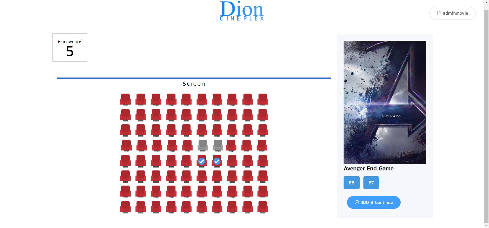
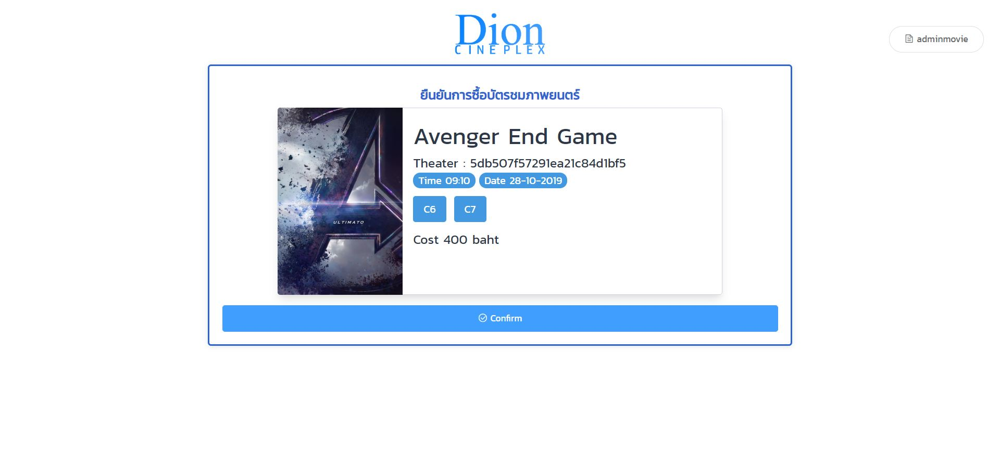
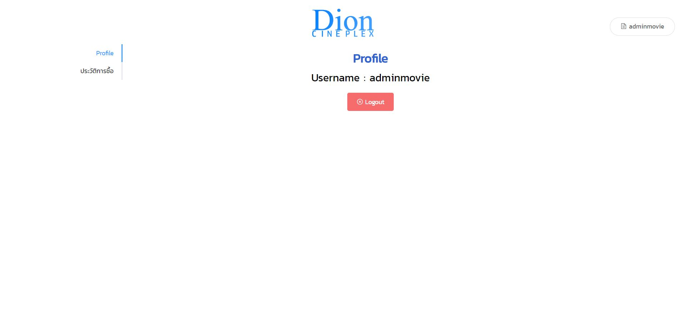
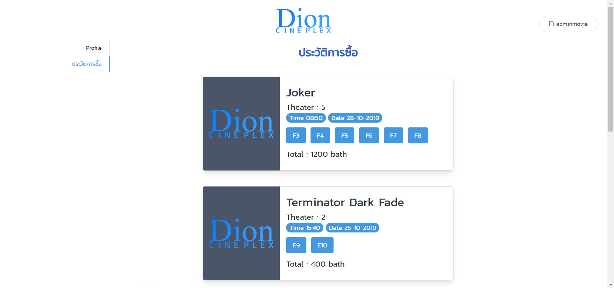
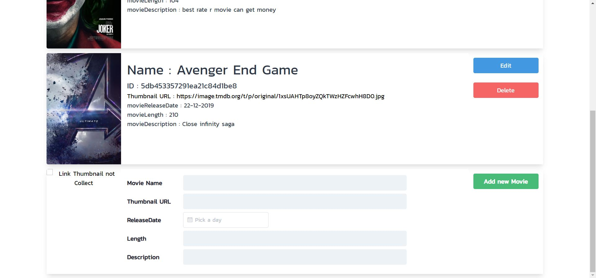
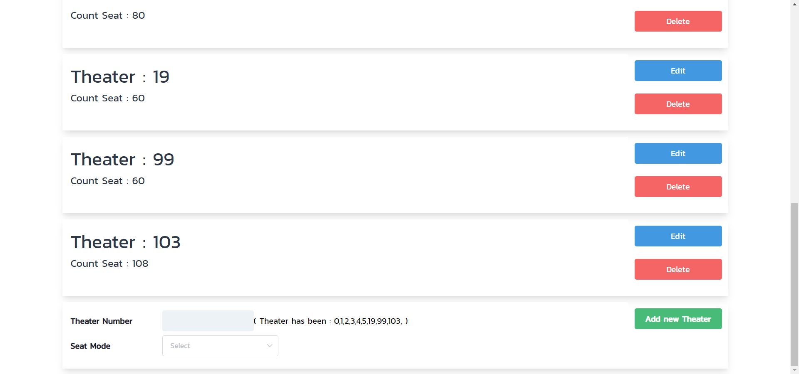
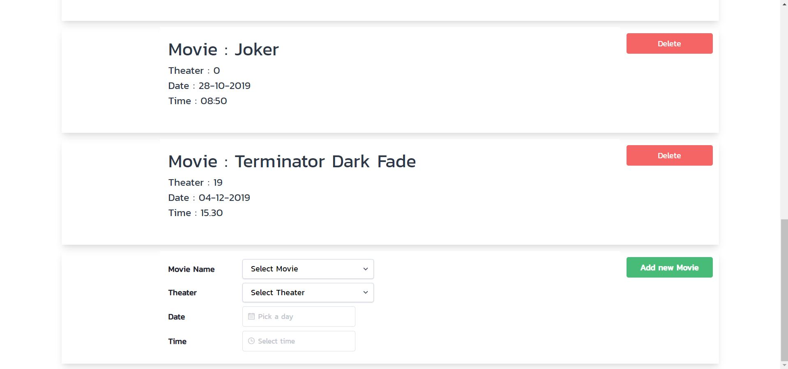

# Thearter-API
Repository for Service Oriented Programming | ITKMITL 2019

## Business Flow

<p align="center">
    
</p>

## Usage

# Showtime Service

### Get all Showtimes
URL : `/showtime`

Method : `GET`

Response example

```json
[
  {
    "id": "5da32f48accef147705f4dd4",
    "movieId": "5db3fcfcaccef102e44d75f4",
    "theaterId": "5db1280f084af14cc0590c92",
    "movieName": "JOKER",
    "movieThumbnail": "picpath",
    "movieReleaseDate": "03-10-2019",
    "movieLength": "120",
    "movieDescription": "This is Short Description of This Film",
    "time": "11.00",
    "date": "04-10-2019",
    "status": true
  },
  {
    "id": "5da32fc4accef147705f4dd5",
    "movieId": "5db3fcfcaccef102e44d75f4",
    "theaterId": "5db1280f084af14cc0590c92",
    "movieName": "JOKER",
    "movieThumbnail": "picpath",
    "movieReleaseDate": "03-10-2019",
    "movieLength": "120",
    "movieDescription": "This is Short Description of This Film",
    "time": "14.00",
    "date": "04-10-2019",
    "status": true
  },
  {
    "id": "5da32fcfaccef147705f4dd6",
    "movieId": "5db3fcfcaccef102e44d75f4",
    "theaterId": "5db12821084af14cc0590c93",
    "movieName": "JOKER",
    "movieThumbnail": "picpath",
    "movieReleaseDate": "03-10-2019",
    "movieLength": "120",
    "movieDescription": "This is Short Description of This Film",
    "time": "12.00",
    "date": "04-10-2019",
    "status": true
  },
  {
    "id": "5da32fd8accef147705f4dd7",
    "movieId": "5db3fcfcaccef102e44d75f4",
    "theaterId": "5db12821084af14cc0590c93",
    "movieName": "JOKER",
    "movieThumbnail": "picpath",
    "movieReleaseDate": "03-10-2019",
    "movieLength": "120",
    "movieDescription": "This is Short Description of This Film",
    "time": "17.00",
    "date": "04-10-2019",
    "status": true
  }
]
```

### Get all Showtimes by TheaterId
URL : `/showtime?theater={theaterId}`

Method : `GET`

Response example

```json
[
  {
    "id": "5da32f48accef147705f4dd4",
    "movieId": "5db3fcfcaccef102e44d75f4",
    "theaterId": "5db1280f084af14cc0590c92",
    "movieName": "JOKER",
    "movieThumbnail": "picpath",
    "movieReleaseDate": "03-10-2019",
    "movieLength": "120",
    "movieDescription": "This is Short Description of This Film",
    "time": "11.00",
    "date": "04-10-2019",
    "status": true
  },
  {
    "id": "5da32fc4accef147705f4dd5",
    "movieId": "5db3fcfcaccef102e44d75f4",
    "theaterId": "5db1280f084af14cc0590c92",
    "movieName": "JOKER",
    "movieThumbnail": "picpath",
    "movieReleaseDate": "03-10-2019",
    "movieLength": "120",
    "movieDescription": "This is Short Description of This Film",
    "time": "14.00",
    "date": "04-10-2019",
    "status": true
  }
]
```

### Get all Showtimes by MovieId

URL : `/showtime?movie={movieId}`

Method : `GET`

Response example

```json
[
  {
    "id": "5da32f48accef147705f4dd4",
    "movieId": "5da32fc4accef147705f4dd5",
    "theaterId": "5db1280f084af14cc0590c92",
    "movieName": "JOKER",
    "movieThumbnail": "picpath",
    "movieReleaseDate": "03-10-2019",
    "movieLength": "120",
    "movieDescription": "This is Short Description of This Film",
    "time": "11.00",
    "date": "04-10-2019",
    "status": true
  },
  {
    "id": "5da32fc4accef147705f4dd5",
    "movieId": "5da32fc4accef147705f4dd5",
    "theaterId": "5db1280f084af14cc0590c92",
    "movieName": "JOKER",
    "movieThumbnail": "picpath",
    "movieReleaseDate": "03-10-2019",
    "movieLength": "120",
    "movieDescription": "This is Short Description of This Film",
    "time": "14.00",
    "date": "04-10-2019",
    "status": true
  },
  {
    "id": "5da32fcfaccef147705f4dd6",
    "movieId": "1",
    "theaterId": "2",
    "movieName": "JOKER",
    "movieThumbnail": "picpath",
    "movieReleaseDate": "03-10-2019",
    "movieLength": "120",
    "movieDescription": "This is Short Description of This Film",
    "time": "12.00",
    "date": "04-10-2019",
    "status": true
  },
  {
    "id": "5da32fd8accef147705f4dd7",
    "movieId": "1",
    "theaterId": "2",
    "movieName": "JOKER",
    "movieThumbnail": "picpath",
    "movieReleaseDate": "03-10-2019",
    "movieLength": "120",
    "movieDescription": "This is Short Description of This Film",
    "time": "17.00",
    "date": "04-10-2019",
    "status": true
  }
]
```

### Get Showtime by Id
URL : `/showtime?id={id}`

Method : `GET`

Response example

```json
{
    "_id": "5da32f48accef147705f4dd4",
    "movieId": "5da32f48accef147705f4dd4",
    "theaterId": "5da32f48accef147705f4dd4",
    "date": "04-10-2019",
    "time": "11.00",
    "status": true,
    "availableSeats": ["A3", "A4", ..., "B10"]
}
```

### Delete Showtime by Date
URL : `/showtime?date={date}`

Method : `DELETE`

Response Example

```json
Delete showtime date: {date} Complete
```

### Add Showtime
URL : `/showtime`

Method : `POST`

Request example

```json
{
  "movieId": "5da32f48accef147705f4dd4",
  "theaterId": "5da32fcfaccef147705f4dd6",
  "date": "04-10-2019",
  "time": "11.00",
  "status": true
}
```

Response example

```json
{
  "id": "5da32f48accef147705f4dd4",
  "movieId": "5da32f48accef147705f4dd4",
  "theaterId": "5da32f48accef147705f4dd4",
  "date": "04-10-2019",
  "time": "11.00",
  "status": true,
  "availableSeats": ["A1", "A2", ..., "B10"]
}
```

### Delete Showtime by Id
URL : `/showtime?id={id}`

Method : `DELETE`

Response Example

```json
Delete showtime _id: {_id} Complete
```

# Movie Service

### Get all Movie Information
URL : `/movie`

Method : `GET`

Response example

```json
[
  {
    "_id": "5da321b7accef147705f4dd0",
    "movieName": "JOKER",
    "movieThumbnail": "picpath",
    "movieReleaseDate": "3-OCT-2019",
    "movieLength": "120",
    "movieDescription": "This is Short Description of This Film"
  },
  {
    "_id": "5da326b8accef147705f4dd2",
    "movieName": "The Matrix",
    "movieThumbnail": "picpath",
    "movieReleaseDate": "24-OCT-2019",
    "movieLength": "120",
    "movieDescription": "This is Short Description of This Film"
  }
]
```

### Get all Movies Information by id
URL : `/movie/{_id}`

Method : `GET`

Response example

```json

{
  "_id": "5da321b7accef147705f4dd0",
  "movieName": "JOKER",
  "movieThumbnail": "picpath",
  "movieReleaseDate": "3-OCT-2019",
  "movieLength": "120",
  "movieDescription": "This is Short Description of This Film"
}

```

### Add Movie
URL : `/movie`

Method : `POST`

Request example

```json
{
  "movieName": "The Matrix",
  "movieThumbnail": "picpath",
  "movieReleaseDate": "24-10-2019",
  "movieLength": "104",
  "movieDescription": "This is Short Description of This Film"
}
```

Response example

```json
{
    "_id": "5db2fab7accef10da071ca0d",
    "movieName": "The Matrix",
    "movieThumbnail": "picpath",
    "movieReleaseDate": "24-10-2019",
    "movieLength": "104",
    "movieDescription": "This is Short Description of This Film"
}
```

### Edit Movie
URL : `/movie/{id}`

Method : `PUT`

Request example

```json
{
  "movieName": "The Matrix",
  "movieThumbnail": "picpath",
  "movieReleaseDate": "24-10-2019",
  "movieLength": "120",
  "movieDescription": "This is Short Description of This Film"
}
```

Response example

```json
{
  "_id": "5db2fb23accef10da071ca0e",
  "movieName": "The Matrix",
  "movieThumbnail": "picpath",
  "movieReleaseDate": "24-10-2019",
  "movieLength": "120",
  "movieDescription": "This is Short Description of This Film"
}
```

### Delete Movie
URL : `/movie/{id}`

Method : `DELETE`


# Theater Service

### Add Theater
URL : `/theater`

Method : `POST`

Request example

```json
{
  "theaterId": "3",
  "seats": ["A1", "A2", ..., "B10"]
}
```

Response example

```json
{
  "_id": "5da32a9eaccef147705f4dd3",
  "theaterId": "3",
  "seats": ["A1", "A2", ..., "B10"]
}
```

### Get Theater
URL : `/theater`

Method : `Get`

Response example

```json
[
  {
  "_id": "5db1280f084af14cc0590c92",
  "theaterId": "1",
  "seats": ["A1", "A2", ..., "B10"]
  },
  {
  "_id": "5db12821084af14cc0590c93",
  "theaterId": "2",
  "seats": ["A1", "A2", ..., "B10"]
  }
]
```

### Get Theater detail by id
URL : `/theater/{_id}`

Method : `GET`

Response example

```json
{
  "_id": "5da32a9eaccef147705f4dd3",
  "theaterId": "3",
  "seats": ["A1", "A2", ..., "B10"]
}
```

### Delete Theater
URL : `/theater/{_id}`

Method : `DELETE`

Response example

```json
Delete theater _id: {_id} Complete
```

# User Service

### Get User's information
URL : `/u`

Method : `GET`

Response example

```json
[
  {
    "username": "user1",
    "tickets": [
      "5db43d8daccef1020cb470ed",
      "5db43d9caccef1020cb470ee"
    ]
  },
  {
    "username": "user2",
    "tickets": [
      "5db43dabaccef1020cb470ef",
      "5db43db8accef1020cb470f0"
    ]
  }
]
```

### Get User's Ticket
URL : `/u/{username}`

Method : `GET`

Response example

```json
[
  {
    "_id": "5db43d8daccef1020cb470ed",
    "username": "user1",
    "showtimeId": "5db3fd80accef102e44d75f6",
    "seats": [
      "A1",
      "A2"
    ]
  },
  {
    "_id": "5db43d9caccef1020cb470ee",
    "username": "user1",
    "showtimeId": "5db3fd8daccef102e44d75f7",
    "seats": [
      "A1",
      "A2"
    ]
  }
]
```

### Reserve
URL : `/u`

Method : `POST`

Request example

```json
{
  "username": "user2",
  "showtimeId": "5db3fd80accef102e44d75f6",
  "seats": ["A3", "A4"]
}
```

Response example

```json
{
  "username": "user2",
  "tickets": [
      "5db43dabaccef1020cb470ef",
      "5db43db8accef1020cb470f0"
  ]
}
```

### Get all Ticket
URL : `/u/ticket`

Method : `GET`

Response example

```json
[
  {
    "_id": "5db43d8daccef1020cb470ed",
    "username": "user1",
    "showtimeId": "5db3fd80accef102e44d75f6",
    "seats": [
      "A1",
      "A2"
    ]
  },
  {
    "_id": "5db43d9caccef1020cb470ee",
    "username": "user1",
    "showtimeId": "5db3fd8daccef102e44d75f7",
    "seats": [
      "A1",
       "A2"
    ]
  },
  {
    "_id": "5db43dabaccef1020cb470ef",
    "username": "user2",
    "showtimeId": "5db3fd8daccef102e44d75f7",
    "seats": [
      "A3",
      "A4"
    ]
  },
  {
    "_id": "5db43db8accef1020cb470f0",
    "username": "user2",
    "showtimeId": "5db3fd80accef102e44d75f6",
    "seats": [
      "A3",
      "A4"
    ]
  }
]
```

### Delete Ticket
URL : `/u/ticket/{id}`

Method : `DELETE`

# Wep Appilcation DionCineplex

go to website

[DionCineplex](http://34.87.24.186/)

> Note : This website is only intended to show the work of api. It can't to booking movies in real life and does not support responsive.

## Page

### Main Page : /

### Method used
> GET /movie

<p align="center">
    
</p>

### Main Page : /nowshowing/5db453357291ea21c84d1be8

### Method used
> GET /showtime?movie={movie_id}
> GET /movie

<p align="center">
    
</p>

### Main Page : /selectseat/5db599c37291ea1b719c0b89

### Method used
> GET /showtime?id={showtime_id}
> GET /theater
> GET /movie

<p align="center">
    
</p>

### Main Page : /payment

### Method used
> GET /showtime?id={showtime_id}
> GET /movie
> PUT /showtime/{showtime_id}  ( Remove selected seat when booking sucess )
> POST /u/ ( Add new ticket in database )

<p align="center">
    
</p>

### Main Page : /profile

### Method used
> GET /u/{username} ( Get ticket by username )

<p align="center">
    
</p>

<p align="center">
    
</p>

### Main Page : /moviemanage

### Method used
> GET /movie
> POST /movie
> PUT /movie/{movie_id}
> DELETE /movie/{movie_id}

<p align="center">
    
</p>

### Main Page : /theaterManager

### Method used
> GET /theater
> POST /theater
> PUT /theater/{theater_id}
> DELETE /theater/{theater_id}

<p align="center">
    
</p>

### Main Page : /showtimemanage

### Method used
> GET /showtime
> POST /showtime
> DELETE /showtime/{showtime_id}

<p align="center">
    
</p>

### Main Page : /ticket-all

### Method used
> GET /u

<p align="center">
    
</p>
